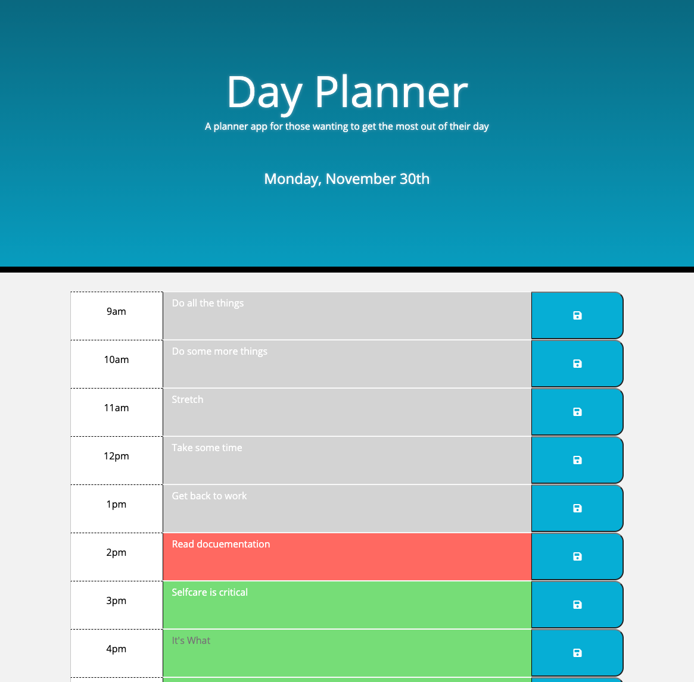
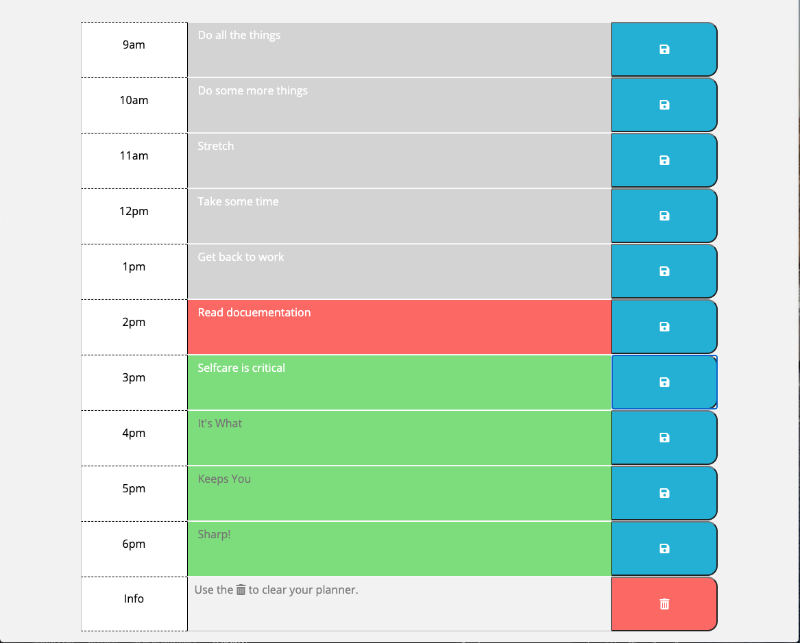

## <a id="back-to-top" > </a>
# Day-Planner
A planner for those that want to organize their day with an application.
__________________________
## Introduction
My name is **Bryson Palmer** and I'm a student web developer. I'm currently in a *full stack* web developer bootcamp through the *University of Washington* under *Trilogy Education Services*. I'm looking to get into web development for my professional work. I plan on being a capable, creative, team oriented developer by the end of this program. I look forward to implementing this new skill in future employment.

## Page Navigation Links
[User Story](#user-story) </br>
[Criteria](#criteria) </br>
[Links to Git Hub and Live url](#links) </br>
[Screenshot of top of app](#screenshot-top) </br>
[Screenshot of bottom of app](#screenshot-bottom) </br>
[Future Tickets](#future-tickets) </br>
[Other Information](#other-information) </br>

## <a id="user-story"></a> User Story
```
AS AN employee with a busy schedule
I WANT to add important events to a daily planner
SO THAT I can manage my time effectively
```
## <a id="criteria"></a> 💼 Criteria
```
GIVEN I am using a daily planner to create a schedule
WHEN I open the planner
THEN the current day is displayed at the top of the calendar
WHEN I scroll down
THEN I am presented with timeblocks for standard business hours
WHEN I view the timeblocks for that day
THEN each timeblock is color coded to indicate whether it is in the past, present, or future
WHEN I click into a timeblock
THEN I can enter an event
WHEN I click the save button for that timeblock
THEN the text for that event is saved in local storage
WHEN I refresh the page
THEN the saved events persist
```
- [✔️] **Status Complete**

__________________________

## <a id="links"></a> Links
Link to my **repository** on **Git Hub** - [https://github.com/Bryson-Palmer/Day-Planner.git](https://github.com/Bryson-Palmer/Day-Planner.git)

Live **URL** link to the **Day Planner** - [https://bryson-palmer.github.io/Day-Planner/](https://bryson-palmer.github.io/Day-Planner/)
</br>
__________________________

## 📸 <a id="screenshot-top"></a> Screenshot of top of app



## 📸 <a id="screenshot-bottom"></a> Screenshot of bottom of app



## <a id="future-tickets"></a> 🔍 Future Tickets
* I would like to add a modal to handle the `Clear All` button, text information, and function. That way it gives the user a second chance from deleting all of their data entries.

* I would like to add a double click feature to the save button to strike through the text of the selected hour.

## <a id="other-information" /></a> 📡 Other Information
* Installation: Go to the live link <a href="https://github.com/Bryson-Palmer/Day-Planner.git">[Here]</a> and start planning your day. That's it!
* Usage: A planner app for those wanting to get the most out of their day.
* Credits: I followed the instructor's homework demo from class to set up my initial files. I used google, w3 schoolsl, and web md sites to understand and implement the techniques used. I also went over previous activities to get an understanding of jquery, bootstrap, on(clicks), DOM traversal, and local storage. I'd also like to thank fellow student Daniel Soledad for helping me find my error in getting my local storage out and displayed in the text area. 
* License: No license at this time.

[Back to Top](#back-to-top) </br>